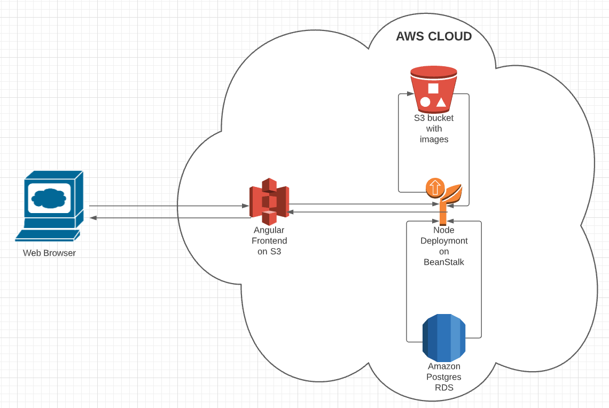

# Infrastructure Description

## AWS services

- **RDS**
  - Publicly accessible PostgreSQL dataase
- **S3**
  - Frontend hosting service provide by S3
  - S3 Storage service for storing images posted
- **Elastic Beanstalk**
  - Backend hosting using the Nodejs Environment

## Infrastracture Schema

