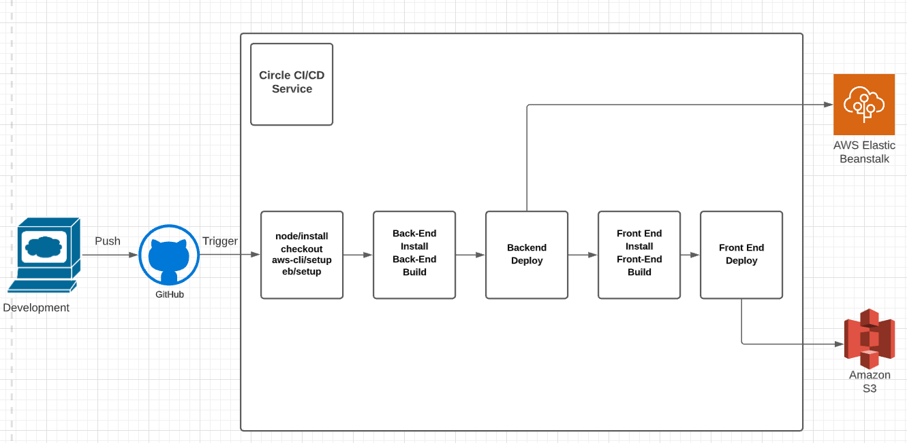

# Pipeline Description

This document contains a description of the pipeline process
applied for this project

## Software applications

The pipeline process uses the following software applications:

1. Github for the central code repository
2. Circle Ci Continuous Development and Integration

## Order of execution

1. The pipeline uses orbs to install Node, the AWS cli and the EB cli.
2. Check out the code from the repo
3. Backend install and build
4. Backend deployment to AwS Elastic Beanstalk
5. FrontEnd install and build
6. FrontEnd deployment to AwS S3

## Schema

